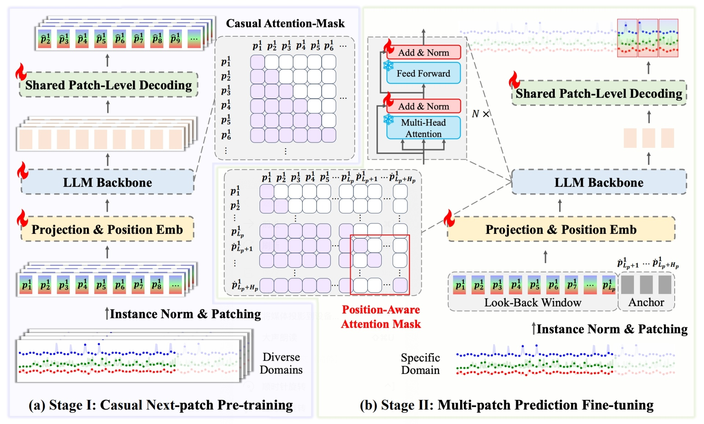
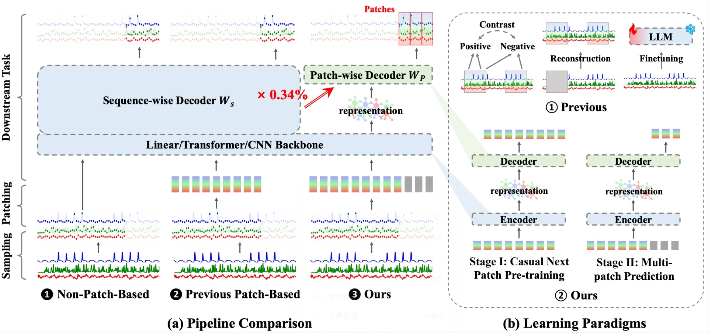

<div align="left">
  <h1><b> aLLM4TS </b></h1>
</div>

This repository contains the implementation of the ICML2024 paper "Multi-Patch Prediction: Adapting LLMs for Time Series Representation Learning" 

> [Yuxuan Bian](https://yxbian23.github.io/)<sup>12</sup>, [Xuan Ju](https://juxuan27.github.io/)<sup>1</sup>, [Jiangtong Li](https://www.jiangtongli.me/)<sup>1</sup>, [Zhijian Xu](https://github.com/VEWOXIC)<sup>1</sup>, [Dawei Cheng](http://cs1.tongji.edu.cn/~dawei/)<sup>2*</sup>, [Qiang Xu](https://cure-lab.github.io/)<sup>1*</sup><br>
> <sup>1</sup>The Chinese University of Hong Kong <sup>2</sup>Tongji University <sup>*</sup>Corresponding Author

<p align="center">
  <a href='https://arxiv.org/abs/2402.04852'>
  
  </a> 
  <a href='https://arxiv.org/pdf/2402.04852.pdf'>
  
  </a> 
  <a href='https://github.com/yxbian23/aLLM4TS'>
  </a> 
  <a href='https://github.com/yxbian23/aLLM4TS'>
  </a> 
</p>


**📖 Table of Contents**

- [📖 Abstract](#-abstract)
- [🔍 System Overview](#-system-overview)
- [🚀 Quick Start](#-quick-start)
  - [Requirements](#requirements)
  - [Datasets](#datasets)
  - [Quick Demos](#quick-demos)
- [🤝🏼 Citation](#-citation)
- [💖 Acknowledgement](#-acknowledgement)


## 📖 Abstract
> In this study, we present $\text{aL\small{LM}4T\small{S}}$, an innovative framework that adapts Large Language Models (LLMs) for time-series representation learning. Central to our approach is that we reconceive time-series forecasting as a self-supervised, multi-patch prediction task, which, compared to traditional contrastive learning or mask-and-reconstruction methods, captures temporal dynamics in patch representations more effectively. Our strategy encompasses two-stage training: (i). a causal continual pre-training phase on various time-series datasets, anchored on next patch prediction, effectively syncing LLM capabilities with the intricacies of time-series data; (ii). fine-tuning for multi-patch prediction in the targeted time-series context. A distinctive element of our framework is the patch-wise decoding layer, which departs from previous methods reliant on sequence-level decoding. Such a design directly transposes individual patches into temporal sequences, thereby significantly bolstering the model's proficiency in mastering temporal patch-based representations. $\text{aL\small{LM}4T\small{S}}$ demonstrates superior performance in several downstream tasks, proving its effectiveness in deriving temporal representations with enhanced transferability and marking a pivotal advancement in the adaptation of LLMs for time-series analysis.


## 🔍 System Overview

:star2: **Two-stage Self-supervised Forecasting-based Training**: Central to our approach is that we reconceive time-series forecasting as a self-supervised, multi-patch prediction task, which, compared to traditional mask-and-reconstruction methods, captures temporal dynamics in patch representations more effectively.


:star2: **Patch-wise Decoding**: A distinctive element of our framework is the patch-wise decoding layer, which departs from previous methods reliant on sequence-level decoding. Such a design directly transposes individual patches into temporal sequences, thereby significantly bolstering the model's proficiency in mastering temporal patch-based representations.




## 🚀 Quick Start
### Requirements
- accelerate==0.21.0
- bitsandbytes==0.41.1
- cmake==3.24.1.1
- Cython==0.29.34
- datasets==2.14.3
- deepspeed==0.9.3
- einops==0.6.1
- numpy==1.22.2
- safetensors==0.3.3
- scikit-learn==1.3.0
- sentencepiece==0.1.99
- sktime==0.25.0
- thop==0.1.1.post2209072238
- torch==2.0.0
- torchinfo==1.8.0
- torchsummary==1.5.1
- transformers==4.34.0

To create the environment and install all dependencies:
```shell
conda create -n allm4ts python=3.10 -y
conda activate allm4ts
pip install -r requirements.txt
```

### Datasets
You can access the well pre-processed datasets from [[Google Drive]](https://drive.google.com/file/d/1DnNz8_XGop9nEESsy_tXbpxVfmsfnJ6A/view?usp=drive_link), then place the downloaded contents under `./dataset`

### Quick Demos
1. Download datasets and place them under `./dataset`
2. Conduct the stage 1: Casual Next-patch Continual Pre-training. We provide a experiment script for demonstration purpose under the folder `./scripts`. For example, you can conduct stage 1 continual pre-training by:
```bash
bash ./scripts/pretrain/all_s16.sh
```

3. Tune the model in different time-series analysis tasks. We provide many experiment scripts for demonstration purpose under the folder `./scripts`. For example, you can evaluate the long-term forecasting or the anomaly detection by:

```bash
bash ./scripts/long-term-forecasting/all.sh
bash ./scripts/anomaly-detection/all.sh
```

## 🤝🏼 Citation
If you find the code is useful in your research, please cite us: 

```
@article{bian2024multi,
  title={Multi-Patch Prediction: Adapting LLMs for Time Series Representation Learning},
  author={Bian, Yuxuan and Ju, Xuan and Li, Jiangtong and Xu, Zhijian and Cheng, Dawei and Xu, Qiang},
  journal={International Conference on Machine Learning ({ICML})},
  year={2024}
}
```


## 💖 Acknowledgement

We appreciate the following github repo very much for the valuable code base and datasets: [DLinear](https://github.com/cure-lab/LTSF-Linear), [PatchTST](https://github.com/yuqinie98/PatchTST), [Time-Series-Library](https://github.com/thuml/Time-Series-Library), and [OneFitsAll](https://github.com/DAMO-DI-ML/NeurIPS2023-One-Fits-All). Thanks to all contributors!